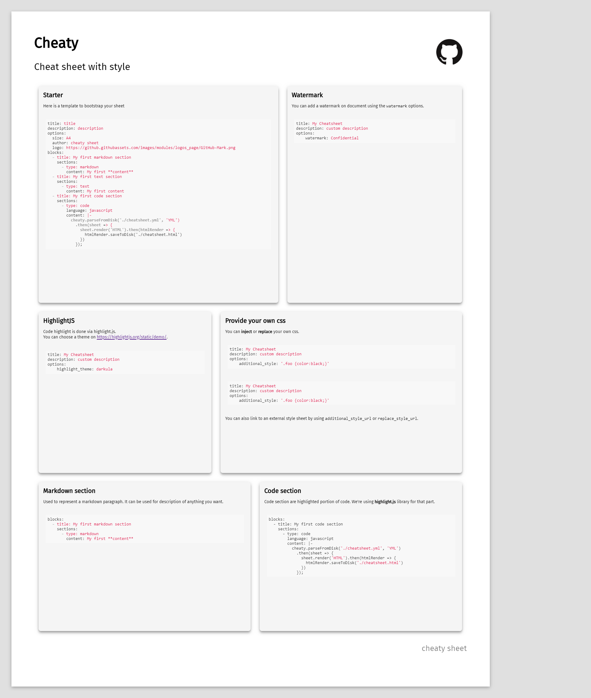

# Cheaty
Easily create your cheat-sheet !

## Installation
`npm i @cheaty-sheet/cheaty` or `npm i -g @cheaty-sheet/cheaty` to use the cli in your whole system.


## Usage
Cheaty is made to simple as simple as possible. You can use it as script or as CLI.
the main goal of cheaty is to convert a cheat sheet definition into a real one.
For that, we use a system of parser and renderer.

Rendered cheat sheet are **print ready, A4 formatted, html files**.

### Script
```javascript
const cheaty = require("@cheaty-sheet/cheaty");
const YMLParser = cheaty.parsers.YMLParser;
const HTMLRenderer = cheaty.renderers.HTMLRenderer;

new YMLParser().parseFromDisk("./cheatsheet.yml").then(sheet => {
  new HTMLRenderer().render(sheet).then(render => {
    render.saveToDisk("./cheatsheet.html");
  });
});
```

`YMLParser` instance have a `parseFromDisk('PATH')` method which will parse your sheet cheat. For now, we only provide
a YML parser. But you can expect more to come in the future ! 
Then as for parser, we can instantiate a `HTMLRenderer` which have a `render(sheet)` method to render your sheet cheat.
And for now, we only support `HTML` rendering. The returned `render` object have 2 method : `.toString()` to get the cheatsheet as (html) string, and
`.savetoDisk(OUTPUT_PATH)` to directly save your generated sheet cheat on disk.

> Parser also have a `.parseFromString(STRING)` to directly parse content. Here you would pass a YML string.

### CLI
One simpler option is to directly use the `cheaty` command.
```text
cheaty render <inputs...>

render the given input

Positionals:
  inputs  input(s) yaml file                                            [string]

Options:
  --version     Show version number                                    [boolean]
  -h, --help    Show help                                              [boolean]
  -o, --output  output folder                           [string] [default: "./"]
```
So you could use `cheaty cheatsheet.yml` and then open the newly created `cheatsheet.html` file.

### Real time preview
Using [nodemon](https://github.com/remy/nodemon) you can restart the cli on each modification of your sheet.
Here is an example using the cheaty cli `nodemon -e yml --exec "cheaty render" cheatsheet.yml`.
You can also use nodemon to watch the build script from the previous part of this doc `nodemon -e yml script.js`. 

> We also provide a [VScode live preview](https://marketplace.visualstudio.com/items?itemName=cheaty-sheet.pcheaty) extension for cheaty !


## YML syntax
Cheat sheet are divided into the following structure : `block > section`.
The most basic cheat sheet would be
```text
title: My Cheatsheet
description: custom description
blocks:
  - title: My first block
    sections:
      - type: text
        content: My first content
```

A sheet could contain as many blocks as needed, depending on the block size (it have to fit on an A4 paper).

Minimal required properties are :
* A **title**
* A **description**, which can be empty
* An **array of blocks**, which must contain at least **one block**, with at least **one section** in it.

> Title and description can be markdown

### Options
It is possible to override some parameters in cheaty by using the **options** block.

```text
title: My Cheatsheet
description: custom description
options:
    key: value
blocks:
  - title: My first block
    sections:
      - type: text
        content: My first content
```
#### Paper size
You can customize the sheet paper size using the `size` options.
It accept the following value : 
* A3
* A4
* A5
* legal
* letter

All format have landscape possibilities like `A4 landscape`

**default**: `A4`

```yaml
title: My Cheatsheet
description: custom description
options:
    size: A5 landscape
```

#### Author
You can add a author mention using the `author` options. This option fully support markdown.

```yaml
title: My Cheatsheet
description: custom description
options:
    author: Hello [cheaty sheet](http://my-site.com)
```

Note that due to YML limitation, a single markdown link is not a valid string.
You'll have to write it like `author: "[cheaty sheet](http://my-site.com)"`


#### Logo
You can add a logo on document using the `logo` options.

```yaml
title: My Cheatsheet
description: custom description
options:
    logo: http://your-site.com/logo.png
```

#### Watermark
You can add a watermark on document using the `watermark` options.

```yaml
title: My Cheatsheet
description: custom description
options:
    watermark: Confidential
```

#### Highlight.js theme
Code highlight is done via [highlight.js](https://highlightjs.org/).
You can choose a theme on the [demo](https://highlightjs.org/static/demo/) page.

**default**: `github`

```yaml
title: My Cheatsheet
description: custom description
options:
    highlight_theme: darkula
```

#### Provide your own css
You can **inject** or **replace** your own css.

To add css :
```yaml
title: My Cheatsheet
description: custom description
options:
    additional_style: '.foo {color:black;}'
```

To overwrite cheaty css:
```yaml
title: My Cheatsheet
description: custom description
options:
    replace_style: '.foo {color:black;}'
```

> replace_style has priority over additional_style, thus having replace_style in options will deactivate any other
style relative option.

You can also link to an external style sheet by using `additional_style_url` or `replace_style_url`.

### Blocks and Sections
A block represent a reserved space on the sheet paper. It must have a **title** and at least **one section**.
A block can contain as many sections are needed.

Section are the real content of you sheet. At least, each section will have a **type** and **content** property.
As you might have now guessed, they are multiple block type.


#### Text section
Used to represent a text paragraph. It can be used for description of anything you want
```yaml
type: text
content: My first content
```

#### Markdown section
Used to represent a text paragraph. It can be used for description of anything you want.
```yaml
type: markdown
content: My first **link** to [google](http://www.google.com)
```

> We support **github flavored markdown**. Check the [documentation](https://guides.github.com/features/mastering-markdown/) for all features.

#### Code section
Code section are highlighted portion of code. We're using [highlight.js](https://highlightjs.org/) library for that part.
```yaml
type: code
language: javascript
content: |-
  cheaty.parseFromDisk('./cheatsheet.yml', 'YML')
      .then(sheet => {
          sheet.render('HTML').then(htmlRender => {
              htmlRender.saveToDisk('./cheatsheet.html')
          })
      });
```

`language` will be inserted in the html to force highlight.js to detect this syntax. So we are not relying on syntax
auto detection here.

> We are using multiline yaml string to insert code in the yaml file.

Please refer to the **Options** section of this documentation for theme customization.

## Full example
You can go retrieve the cheat sheet of cheaty [here](cheatsheet.yml), use it as example.
We also provide a [PDF version](cheatsheet.pdf).

