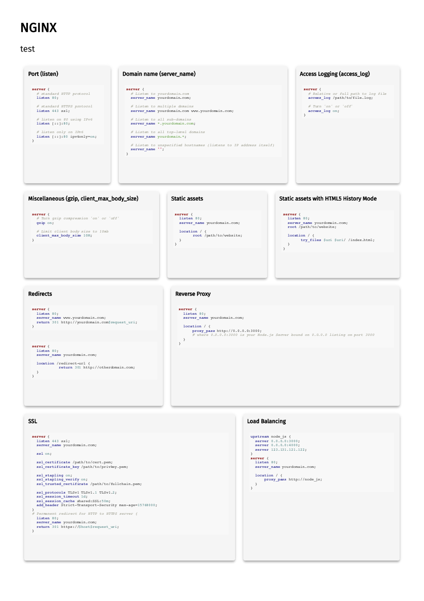

# Cheaty
Easily create your cheat-sheet !

## Installation
`npm i @cheaty-sheet/cheaty` or `npm i -g @cheaty-sheet/cheaty` to use the cli in your whole system.


## Usage
Cheaty is made to simple as simple as possible. You can use it as script or as CLI.
the main goal of cheaty is to convert a cheat sheet definition into a real one.
For that, we use a system of parser and renderer.

Rendered cheat sheet are **print ready, A4 formatted, html files**.

### Script
```javascript
const cheaty = require('@cheaty-sheet/cheaty');


cheaty.parseFromDisk('./cheatsheet.yml', 'YML')
    .then(sheet => {
        sheet.render('HTML').then(htmlRender => {
            htmlRender.saveToDisk('./cheatsheet.html')
        })
    });
```

`cheaty.parseFromDisk('PATH', 'PARSER_NAME')` will parse your sheet cheat. For now, only `YML` is a valid parser.
But you can expect more to come in the future !
Then `sheet.render('RENDERER_NAME')` will render your sheet cheat. As for parser, for now, we only support `HTML`
rendering. The returned object have 2 method : `.toString()` to get the cheatsheet as (html) string, and
`.savetoDisk(OUTPUT_PATH)` to directly save your generated sheet cheat on disk.

### CLI
One simpler option is to directly use the `cheaty` command.
```text
cheaty <command>

Commands:
  cheaty render <inputs...>  render the given input

```
So you could use `cheaty cheatsheet.yml` and then open the newly created `cheatsheet.html` file.

## Style and theme
Styling and theme are done with css. We are planning to implement style and theme customization in the near future.

## YML syntax
Cheat sheet are divided into the following structure : `block > section`.
The most basic cheat sheet would be
```text
title: My Cheatsheet
description: custom description
blocks:
  - title: My first block
    sections:
      - type: text
        content: My first content
```

A sheet could contain as many blocks as needed, depending on the block size (it have to fit on an A4 paper).

Minimal required properties are :
* A **title**
* A **description**, which can be empty
* An **array of blocks**, which must contain at least **one block**, with at least **one section** in it.

### Options
It is possible to override some parameters in cheaty by using the **options** block.

```text
title: My Cheatsheet
description: custom description
options:
    key: value
blocks:
  - title: My first block
    sections:
      - type: text
        content: My first content
```

#### Highlight.js theme
Code highlight is done via [highlight.js](https://highlightjs.org/).
You can choose a theme on the [demo](https://highlightjs.org/static/demo/) page.

**default**: `github`

```yaml
title: My Cheatsheet
description: custom description
options:
    highlight_theme: darkula
```

#### Provide your own css
You can **inject** or **replace** your own css.

To add css :
```yaml
title: My Cheatsheet
description: custom description
options:
    additional_style: '.foo {color:black;}'
```

To overwrite cheaty css:
```yaml
title: My Cheatsheet
description: custom description
options:
    replace_style: '.foo {color:black;}'
```

> replace_style has priority over additional_style, thus having replace_style in options will deactivate any other
style relative option.

### Blocks and Sections
A block represent a reserved space on the sheet paper. It must have a **title** and at least **one section**.
A block can contain as many sections are needed.

Section are the real content of you sheet. At least, each section will have a **type** and **content** property.
As you might have now guessed, they are multiple block type.


#### Text section
Used to represent a text paragraph. It can be used for description of anything you want
```yaml
type: text
content: My first content
```

#### Markdown section
Used to represent a text paragraph. It can be used for description of anything you want.
```yaml
type: markdown
content: My first **link** to [google](http://www.google.com)
```

> We support **github flavored markdown**. Check the [documentation](https://guides.github.com/features/mastering-markdown/) for all features.

#### Code section
Code section are highlighted portion of code. We're using [highlight.js](https://highlightjs.org/) library for that part.
```yaml
type: code
language: javascript
content: >-
  cheaty.parseFromDisk('./cheatsheet.yml', 'YML')
      .then(sheet => {
          sheet.render('HTML').then(htmlRender => {
              htmlRender.saveToDisk('./cheatsheet.html')
          })
      });
```

`language` will be inserted in the html to force highlight.js to detect this syntax. So we are not relying on syntax
auto detection here.

> We are using multiline yaml string to insert code in the yaml file.

Please refer to the **Options** section of this documentation for theme customization.

## Full example
Here is a complete example of an nginx cheet sheet

```yaml
title: NGINX
description: "test"
blocks:
  - title: Port (listen)
    sections:
      - type: code
        language: nginx
        content: >-
          server {
            # standard HTTP protocol
            listen 80;

            # standard HTTPS protocol
            listen 443 ssl;

            # listen on 80 using IPv6
            listen [::]:80;

            # listen only on IPv6
            listen [::]:80 ipv6only=on;
          }
  - title: Domain name (server_name)
    sections:
      - type: code
        language: nginx
        content: >-
          server {
            # Listen to yourdomain.com
            server_name yourdomain.com;

            # Listen to multiple domains
            server_name yourdomain.com www.yourdomain.com;

            # Listen to all sub-domains
            server_name *.yourdomain.com;

            # Listen to all top-level domains
            server_name yourdomain.*;

            # Listen to unspecified hostnames (listens to IP address itself)
            server_name "";
          }
  - title: Access Logging (access_log)
    sections:
      - type: code
        language: nginx
        content: >-
          server {
            # Relative or full path to log file
            access_log /path/to/file.log;

            # Turn 'on' or 'off'
            access_log on;
          }
  - title: Miscellaneous (gzip, client_max_body_size)
    sections:
      - type: code
        language: nginx
        content: >-
          server {
            # Turn gzip compression 'on' or 'off'
            gzip on;

            # Limit client body size to 10mb
            client_max_body_size 10M;
          }
  - title: Static assets
    sections:
      - type: code
        language: nginx
        content: >-
          server {
            listen 80;
            server_name yourdomain.com;

            location / {
            	root /path/to/website;
            }
          }
  - title: Static assets with HTML5 History Mode
    sections:
      - type: code
        language: nginx
        content: >-
          server {
            listen 80;
            server_name yourdomain.com;
            root /path/to/website;

            location / {
            	try_files $uri $uri/ /index.html;
            }
          }
  - title: Redirects
    sections:
      - type: code
        language: nginx
        content: >-
          server {
            listen 80;
            server_name www.yourdomain.com;
            return 301 http://yourdomain.com$request_uri;
          }
      - type: code
        language: nginx
        content: >-
          server {
            listen 80;
            server_name yourdomain.com;

            location /redirect-url {
          	    return 301 http://otherdomain.com;
            }
          }
  - title: Reverse Proxy
    sections:
      - type: code
        language: nginx
        content: >-
          server {
            listen 80;
            server_name yourdomain.com;

            location / {
                proxy_pass http://0.0.0.0:3000;
                # where 0.0.0.0:3000 is your Node.js Server bound on 0.0.0.0 listing on port 3000
            }
          }
  - title: SSL
    sections:
      - type: code
        language: nginx
        content: >-
          server {
            listen 443 ssl;
            server_name yourdomain.com;

            ssl on;

            ssl_certificate /path/to/cert.pem;
            ssl_certificate_key /path/to/privkey.pem;

            ssl_stapling on;
            ssl_stapling_verify on;
            ssl_trusted_certificate /path/to/fullchain.pem;

            ssl_protocols TLSv1 TLSv1.1 TLSv1.2;
            ssl_session_timeout 1d;
            ssl_session_cache shared:SSL:50m;
            add_header Strict-Transport-Security max-age=15768000;
          }

          # Permanent redirect for HTTP to HTTPS
          server {
            listen 80;
            server_name yourdomain.com;
            return 301 https://$host$request_uri;
          }
  - title: Load Balancing
    sections:
      - type: code
        language: nginx
        content: >-
          upstream node_js {
            server 0.0.0.0:3000;
            server 0.0.0.0:4000;
            server 123.131.121.122;
          }

          server {
            listen 80;
            server_name yourdomain.com;

            location / {
                proxy_pass http://node_js;
            }
          }
```

